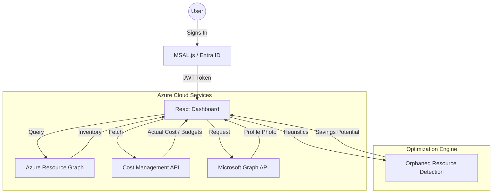

# Azure Financial Insights ☁️💰

**Azure Financial Insights** is a state-of-the-art cloud management dashboard designed for real-time financial transparency, automated budget enforcement, and resource optimization. Built with a premium glassmorphism aesthetic, it provides Azure administrators and finance teams with a high-fidelity view of their cloud spend and infrastructure health.

## 🚀 Key Features

- **Real-Time Financial Transparency**: Direct integration with Azure Cost Management API to provide up-to-the-minute MTD (Month-to-Date) spend.
- **Automated Budget Management**: One-click provisioning of Azure Budgets with pre-configured thresholds (80%) and automated email alerts.
- **Orphaned Resource Tracking**: Advanced heuristic engine (using Azure Resource Graph) to identify unattached disks, idle public IPs, and abandoned network interfaces.
- **Service-Wise Optimization**: Granular breakdown of costs and savings potential grouped by Azure service category.
- **Secure Authentication**: Enterprise-grade security using MSAL (Microsoft Authentication Library) for secure Entra ID (Azure AD) sign-in.
- **Premium Design**: Fully responsive, mobile-optimized UI featuring glassmorphism effects, dynamic charts (Recharts), and modern typography.

---

## 🏗️ Architecture Flow

The application follows a modern decoupled architecture, communicating directly with the Azure ARM and Microsoft Graph endpoints from the client side.



---

## 🛠️ Technology Stack

- **Frontend**: React 19 (Vite)
- **Styling**: Vanilla CSS (Modern Grid/Flexbox with Glassmorphism)
- **Authentication**: `@azure/msal-react` & `@azure/msal-browser`
- **Charts**: `recharts`
- **Icons**: `lucide-react`
- **Cloud APIs**: 
  - Microsoft Graph (User Profile & Photo)
  - Azure Resource Graph (Resource Inventory)
  - Microsoft.CostManagement (Consumption & Budgets)
  - Microsoft.Consumption (Budget Creation)

---

## ⚙️ Configuration

The application is configured to target a specific Azure Tenant by default.

- **Tenant ID**: `xxxxxxxx-xxxx-xxxx-xxxx-xxxxxxxxxxxx`
- **Application ID**: `xxxxxxxx-xxxx-xxxx-xxxx-xxxxxxxxxxxx`

To deploy your own instance, update the `src/authConfig.js` file with your specific Client ID and Tenant ID.

---

## 📦 Getting Started

1. **Install Dependencies**:
   ```bash
   npm install
   ```

2. **Run Locally**:
   ```bash
   npm run dev
   ```

3. **Build for Production**:
   ```bash
   npm run build
   ```

---

## 👨‍💻 Author

**Francis Cruz**
- [GitHub](https://github.com/ajf013)
- [LinkedIn](https://www.linkedin.com/in/ajf013-francis-cruz/)
- [Portfolio](https://fcruz.org)

*Copyright © 2026 Azure Cloud Insights Dashboard • MCT Developer Edition*
